## Testing
The goal is to be able to easily write test that verifies that the execution runs as expected in an introspection environment without needing to having to debug against the full toolchain for the zkvm toolchain.

## Current implementation
The initial version was implemented in the first [PR to this project](https://github.com/2xic/erigon-risc-v-executable-proof-sourcing/pull/1) where we implement this architecture.

```mermaid
flowchart TD
    A[EVM Bytecode] --> B[Tracer with Mock State]
    
    B --> C[Execution ↔ Transpiler<br/>State hooks capture instructions]
    
    C --> D[Assembly Generation]
    
    D --> E[Two Assembly Formats]
    
    E --> F[Debug Assembly<br/>includes EBREAK]
    E --> G[Prover Toolchain Assembly<br/>excludes EBREAK]
    
    F --> H[Compile to RISC-V Bytecode<br/>]
    
    H --> I[Unicorn Engine Execution<br/>RISC-V 64-bit emulation]
    
    I --> J[EBREAK Hook Handler<br/>Captures stack snapshots]
    
    J --> K[Stack Snapshots<br/>After each transpiled EVM instruction]
    
    K --> L[Test Verification<br/>Assert expected stack values]
    
    G --> M[Small Wrapper Around Toolchain Handles The Compilation]
    
    M --> N[ZK Prover Integration<br/>Test Of Proof Generation]    
```

So there are two ways we do testing which we will break down.

### Using [Unicorn](https://www.unicorn-engine.org/)
We transpile the execution trace to include `EBREAK` opcode between each transpiled EVM opcode. This allows us to do stack snapshots between each transpiled opcode to make sure these are executing as expected.

### Using the toolchain
We transpile the execution trace as with Unicorn, but without `EBREAK` as we don't need the stack introspection. The assembly is then executed on the target toolchain ([OpenVm](https://github.com/openvm-org/openvm) currently) to make sure it can be executed. We can't reason as much about the results of the execution here, but can at least verify that it does execute.

